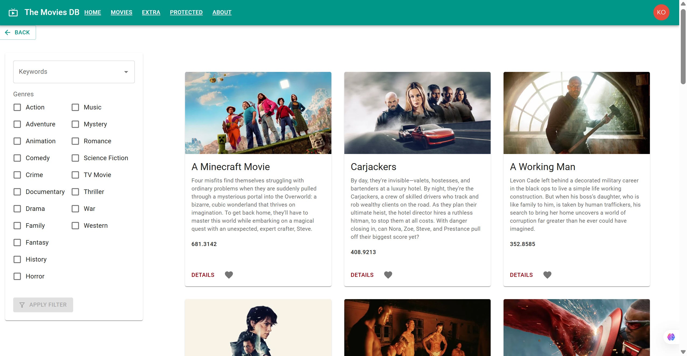
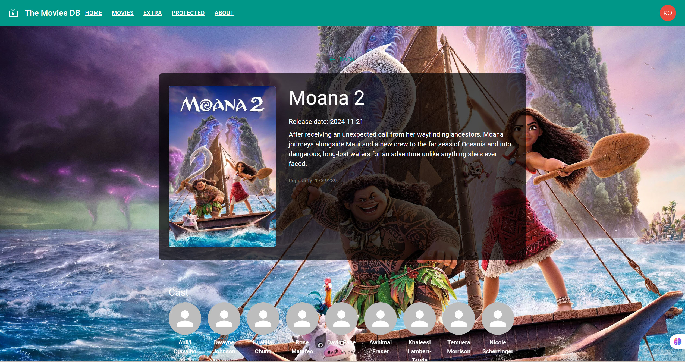
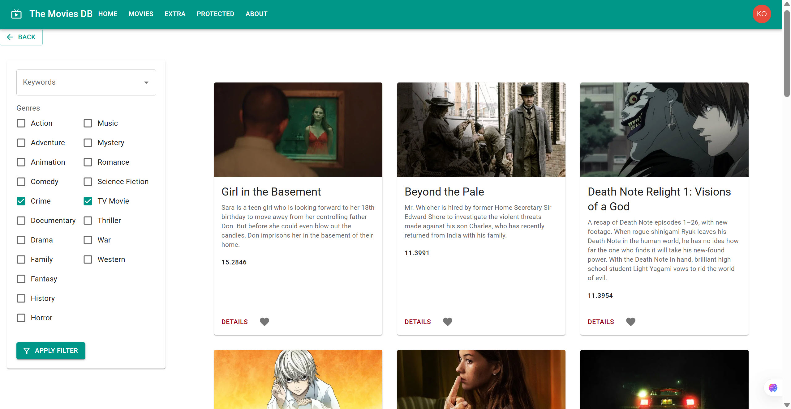

# 🎬 Movies-DB

**Movies-DB** is a modern web application for searching and displaying movie information using the [TMDB API](https://www.themoviedb.org/documentation/api). The goal of the project is to provide users with a convenient and fast way to discover movies, view details, save favorites, write reviews, and keep a personal movie diary.

The project is built with **React + TypeScript + Vite**, focusing on scalability, performance, and clean code architecture. It also integrates **Auth0**, **Redux Toolkit**, **Material UI**, and **GraphQL**.

---

## 📌 Project Goals

- 🔎 Provide a simple and intuitive interface for movie search
- 📊 Display structured information such as ratings, descriptions, and posters
- 🔐 Integrate secure user authentication
- 💾 Allow users to save movies to a personal "favorites" list
- ⚙️ Build an extensible architecture following modern development practices

---

## ✨ Core Features

- Movie search by keyword
- Display movie cards (title, poster, rating, release date)
- Navigate to a detailed movie page
- User authentication via Auth0
- Integration with RTK Query and GraphQL
- Responsive design for mobile and desktop

---

## 🧰 Tech Stack

### Frontend:

- [React](https://reactjs.org/) – Frontend UI library

- [TypeScript](https://www.typescriptlang.org/) – Typed superset of JavaScript

- [Vite](https://vitejs.dev/) – High-performance build tool

- [Material UI (MUI)](https://mui.com/) – Component-based design system

- [React Hook Form](https://react-hook-form.com/) – Form handling and validation

- [Redux Toolkit](https://redux-toolkit.js.org/) – State management solution

- [RTK Query](https://redux-toolkit.js.org/rtk-query/overview) – Data fetching abstraction built into Redux Toolkit

- [GraphQL](https://graphql.org/) – Query language for APIs

- [Auth0](https://auth0.com/) – Authentication & Authorization platform

- [Axios](https://axios-http.com/) – HTTP client for RESTful API requests

- [Leaflet](https://leafletjs.com/) – Interactive maps (optional, for maps)

### Backend

- [Node.js](https://nodejs.org/en) – JavaScript runtime environment for server-side development

- [Express.js](https://expressjs.com/) – Lightweight and flexible web framework for building HTTP servers and APIs

- [dotenv](https://www.dotenv.org/) – Manages environment variables via a .env file

- [CORS](https://developer.mozilla.org/en-US/docs/Web/HTTP/Guides/CORS) – Enables Cross-Origin Resource Sharing to allow requests from the frontend

- **express-jwt** – Middleware for verifying and decoding JWT tokens in Express

- **jwks-rsa** – A library for retrieving and validating JWTs using a JSON Web Key Set (JWKS), often used with Auth0

### Developer Tools:

- [ESLint](https://eslint.org/) – Linter for finding and fixing problems in code

- [Prettier](https://prettier.io/) – Code formatter

---

## ⚙️ Installation & Setup

### 1. Clone the repository:

```bash
git clone https://github.com/Alex3584/movies-db.git
cd movies-db
```

### 2. Install dependencies:

#### ✅ Install Runtime Dependencies
These packages are required for the application to function properly in production:

```bash
npm install \
  @auth0/auth0-react \
  @emotion/react \
  @emotion/styled \
  @fontsource/roboto \
  @mui/icons-material \
  @mui/material \
  @redux-devtools/extension \
  @reduxjs/toolkit \
  @rtk-query/graphql-request-base-query \
  @testing-library/react \
  graphql \
  http-proxy-middleware \
  leaflet \
  react \
  react-dom \
  react-hook-form \
  redux-thunk
```

#### 🧪 Install Development Dependencies
These packages are used during development for linting, typing, SCSS support, building, and running the application:

```bash
npm install -D \
  @eslint/js \
  @types/leaflet \
  @types/node \
  @types/react \
  @types/react-dom \
  @vitejs/plugin-react \
  eslint \
  eslint-plugin-react-hooks \
  eslint-plugin-react-refresh \
  globals \
  sass \
  typescript \
  typescript-eslint \
  vite

```

### 3. Set up environment variables:

Create a `.env` file in the root directory:

```ini
VITE_TMDB_API_KEY=your_tmdb_api_key
VITE_AUTH0_DOMAIN=your_auth0_domain
VITE_AUTH0_CLIENT_ID=your_auth0_client_id
```

### 4. Start the development server:

```bash
npm run dev
```

## 🧪 Scripts

- `npm run dev` -	Start the app in development mode

- `npm run build` -	Build the project for production

- `npm run preview` -	Preview the production build

- `npm run lint` -	Lint the code using ESLint rules

- `npm run format` -	Apply code formatting (if Prettier is added)

## 🖼️ Screenshots

Below will be placed UI screenshots to illustrate key features and pages of the application.

<table>
  <tr> 
    <td> 
      <strong>📍 Home / Search Page</strong><br /> 
       
    </td> 
    <td> 
      <strong>🎬 Movie Details Page</strong><br /> 
       
    </td> 
  </tr> 
  <tr> 
    <td> 
      <strong>🎬 Movie Details Page (Cast Section)</strong><br />
       
    </td> 
    <td> 
      <strong>🎞️ Filter by Genre</strong><br />
      
    </td> 
  </tr> 
</table>


<!-- - 🌙 Dark Mode (if supported) – theme variation preview

- 🔐 Auth flow (login/logout via Auth0)

- 📱 Mobile responsiveness demo -->

# React + TypeScript + Vite

This template provides a minimal setup to get React working in Vite with HMR and some ESLint rules.

Currently, two official plugins are available:

- [@vitejs/plugin-react](https://github.com/vitejs/vite-plugin-react/blob/main/packages/plugin-react/README.md) uses [Babel](https://babeljs.io/) for Fast Refresh
- [@vitejs/plugin-react-swc](https://github.com/vitejs/vite-plugin-react-swc) uses [SWC](https://swc.rs/) for Fast Refresh

## Expanding the ESLint configuration

If you are developing a production application, we recommend updating the configuration to enable type aware lint rules:

- Configure the top-level `parserOptions` property like this:

```js
export default tseslint.config({
  languageOptions: {
    // other options...
    parserOptions: {
      project: ['./tsconfig.node.json', './tsconfig.app.json'],
      tsconfigRootDir: import.meta.dirname,
    },
  },
})
```

- Replace `tseslint.configs.recommended` to `tseslint.configs.recommendedTypeChecked` or `tseslint.configs.strictTypeChecked`
- Optionally add `...tseslint.configs.stylisticTypeChecked`
- Install [eslint-plugin-react](https://github.com/jsx-eslint/eslint-plugin-react) and update the config:

```js
// eslint.config.js
import react from 'eslint-plugin-react'

export default tseslint.config({
  // Set the react version
  settings: { react: { version: '18.3' } },
  plugins: {
    // Add the react plugin
    react,
  },
  rules: {
    // other rules...
    // Enable its recommended rules
    ...react.configs.recommended.rules,
    ...react.configs['jsx-runtime'].rules,
  },
})
```
